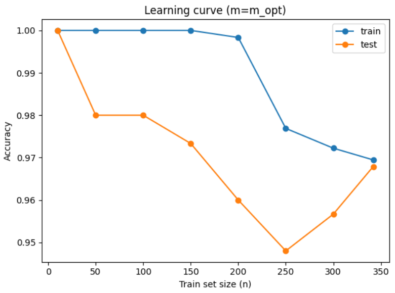

# 🐧 Penguin Species Classification using Naive Bayes and Multi-Layer Perceptron


A machine learning project that investigates **linear** and **non-linear classification** techniques for identifying penguin species based on their physical characteristics.

The project implements and compares two popular supervised learning algorithms:

- **Gaussian Naive Bayes**
- **Multi-Layer Perceptron (MLP) Neural Network**

using the **Palmer Penguins Dataset**.

---

# 📌 Overview

Classification is one of the fundamental tasks in machine learning. This project demonstrates how classical probabilistic models and neural networks perform on the same real-world dataset.

The notebook covers the complete machine learning workflow including:

- Data exploration
- Feature visualization
- Probability estimation
- Linear classification
- Neural network classification
- Performance evaluation
- Cross-validation
- Learning curves
- Model comparison

---

# ✨ Features

- Exploratory Data Analysis (EDA)
- Prior Probability Computation
- Pairwise Feature Visualization
- Gaussian Naive Bayes Classifier
- Multi-Layer Perceptron (MLP)
- Data Normalization
- One-Hot Encoding
- Confusion Matrix
- Classification Report
- Precision / Recall / F1-score
- K-Fold Cross Validation
- Hidden Layer Optimization
- Learning Curve Analysis
- Cardiovascular Risk Prediction Example

---

# 📂 Project Structure

```
penguins-classification/
│
├── notebook/
│   └── penguins_classification.ipynb
│
├── dataset/
│   └── penguins_classification.csv
│
├── images/
│   ├── pairplot.png
│   ├── confusion_matrix.png
│   ├── learning_curve.png
│   └── ...
│
├── requirements.txt
├── LICENSE
├── README.md
└── .gitignore
```

---

# 📊 Dataset

The project uses the **Palmer Penguins Dataset**, a well-known alternative to the Iris dataset for classification tasks.

Each penguin belongs to one of three species:

- Adelie
- Chinstrap
- Gentoo

Two anatomical measurements are used as features:

- Culmen Length
- Culmen Depth

---

# 🧠 Machine Learning Algorithms

## 1. Gaussian Naive Bayes

Naive Bayes is a probabilistic classifier based on **Bayes' Theorem** with the assumption that input features are conditionally independent.

### Workflow

- Estimate prior probabilities
- Estimate Gaussian distribution of each feature
- Compute posterior probabilities
- Predict the class with the maximum posterior probability

### Advantages

- Extremely fast
- Simple implementation
- Works well on small datasets

### Limitations

- Assumes feature independence
- Performance decreases when features are correlated

---

## 2. Multi-Layer Perceptron (MLP)

The neural network model consists of:

- Input Layer
- Hidden Layer
- Output Layer

The project investigates different hidden layer sizes using cross-validation to determine the optimal architecture.

### Workflow

- Normalize data
- Encode labels
- Train the neural network
- Evaluate on unseen samples
- Optimize hidden neurons
- Generate learning curves

### Advantages

- Learns non-linear decision boundaries
- Higher predictive performance
- Better generalization

---

# 📈 Results

The notebook evaluates both models using several performance metrics.

### Evaluation Metrics

- Accuracy
- Precision
- Recall
- F1-score
- Confusion Matrix
- Bayes Risk
- Cross Validation
- Learning Curve

Overall observations:

- Gaussian Naive Bayes provides a simple and effective baseline.
- The MLP classifier achieves superior classification performance.
- Cross-validation confirms that the neural network generalizes well.
- Increasing hidden neurons beyond the optimal point leads to overfitting.

---

# 🖼 Sample Outputs

## Feature Distribution

```
images/pairplot.png
```


---

## Confusion Matrix

```
images/confusion_matrix.png
```


---

## Learning Curve

```
images/learning_curve.png
```



---

# ⚙ Installation

Clone the repository

```bash
git clone https://github.com/yourusername/penguins-classification.git
```

Move into the project

```bash
cd penguins-classification
```

Install dependencies

```bash
pip install -r requirements.txt
```

---

# ▶ Running the Project

Launch Jupyter Notebook

```bash
jupyter notebook
```

Open

```
notebook/penguins_classification.ipynb
```

Run all notebook cells sequentially.

---

# 📚 Libraries Used

- Python
- NumPy
- Pandas
- Matplotlib
- Seaborn
- Scikit-learn
- Jupyter Notebook

---

# 🔬 Experiments Included

- Prior Probability Estimation
- Data Visualization
- Gaussian Naive Bayes Classification
- Bayesian Error Estimation
- Data Normalization
- One-Hot Encoding
- Neural Network Training
- Confusion Matrix Analysis
- Cross Validation
- Hidden Layer Optimization
- Learning Curve Generation
- Cardiovascular Risk Prediction

---

# 🚀 Future Improvements

Possible future extensions include:

- Support Vector Machine (SVM)
- Decision Tree
- Random Forest
- K-Nearest Neighbors
- Logistic Regression
- Hyperparameter Optimization
- Interactive Visualizations
- Model Deployment using Streamlit

---

# 🎯 Learning Objectives

This project demonstrates practical implementation of:

- Supervised Learning
- Probabilistic Classification
- Neural Networks
- Model Evaluation
- Feature Engineering
- Cross Validation
- Performance Analysis

---

# 📄 License

This project is released under the **MIT License**.

---

# 👤 Author

**Parsa Riazi**

GitHub:
https://github.com/parsariazi

---

## ⭐ If you found this project useful, consider giving it a star!
